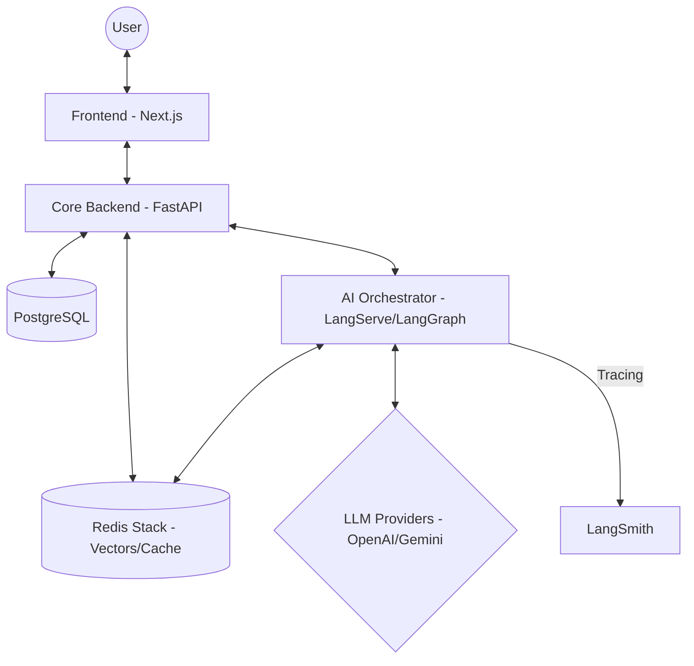

# ModAI - Smart Sales Chatbot (Decoupled Architecture)

ModAI is a SaaS platform designed to automate sales through an intelligent chatbot, initially focused on clothing stores. The system uses a modern microservices architecture, separating core business logic from complex AI orchestration.

## 🏗️ System Architecture

The project consists of 5 main containers working in harmony:



### 📦 Microservices & Components

#### 1. Core Backend (FastAPI)
- **Responsibility**: State management, business rules, persistence, and administrative API.
- **Database**: PostgreSQL for relational data (customers, messages, settings).
- **Integration**: Acts as a client for the AI Orchestrator and manages initial catalog seeding/indexing.

#### 2. AI Orchestrator (LangServe + LangGraph)
- **Responsibility**: Conversation flow orchestration and AI graph execution.
- **LangGraph**: Manages complex states, semantic routing, and information retrieval (RAG).
- **LangServe**: Exposes the AI graph as an isolated service via HTTP.
- **RAG**: Performs vector searches in Redis to find relevant products in real-time.

#### 3. Redis Stack
- **Semantic Cache**: Stores AI responses based on vector similarity to save tokens.
- **Vector Store**: Stores product catalog embeddings for RAG.

---

## 🧠 AI Intelligence & Token Economy

ModAI implements a sophisticated pipeline for cost control and performance:

- **Semantic Routing**: Identifies simple greetings and responds via cache or fast models, saving thousands of tokens.
- **Sliding Window with Summarization**: Message history is asynchronously compressed. Old messages become dense summaries, maintaining context without exceeding model token limits.
- **Financial Monitoring (USD)**: Each interaction calculates the real cost in dollars based on the model used (GPT-4o, Mini, or Gemini Flash) and reports to LangSmith and the database.
- **Cache Auto-Recovery**: The system automatically detects vector dimension mismatches and reconstructs Redis indices without manual intervention.

---

## 🚀 How to Run

### Prerequisites
- **Docker** and **Docker Compose**.
- API Keys for **OpenAI** and/or **Google Gemini**.
- **LangSmith** account (optional, for observability).

### 1. Configuration
Create a `.env` file at the root (use `.env.example` as a template):
```env
OPENAI_API_KEY="your_key"
GOOGLE_API_KEY="your_key"
LANGSMITH_API_KEY="your_key"
LANGSMITH_PROJECT="ModAI"
```

### 2. Startup
```bash
docker compose up -d --build
```
This will start:
- **Frontend**: [http://localhost:3000](http://localhost:3000)
- **Core API**: [http://localhost:8000/docs](http://localhost:8000/docs)
- **AI Engine**: [http://localhost:8080/chat/playground/](http://localhost:8080/chat/playground/)

---

## 📁 Project Structure

```
.
├── backend/                # Business Rules & Persistence
│   ├── app/
│   │   ├── api/            # REST Endpoints
│   │   ├── models/         # PostgreSQL Tables
│   │   ├── services/       # Integration Clients & Token Manager
│   │   └── seed.py         # Auto-creation of tables and data
├── ai_engine/              # AI "Brain" (Isolated)
│   ├── app/
│   │   ├── graph/          # LangGraph Definition (Nodes, Logic)
│   │   ├── cache_service.py# Semantic Cache Logic
│   │   ├── rag_service.py  # Vector Product Search
│   │   └── server.py       # LangServe API
├── frontend/               # Next.js Interface (CRM & Chat)
└── docker-compose.yml      # Infrastructure Orchestrator
```

## 🧹 Database Maintenance
To completely reset the database and search indices (total wipe):
```bash
docker compose down -v
docker compose up -d
```
